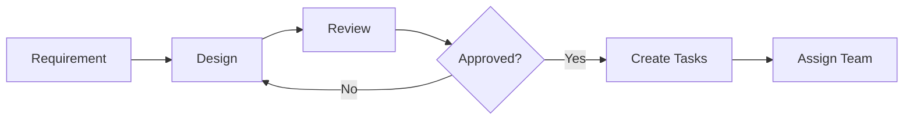
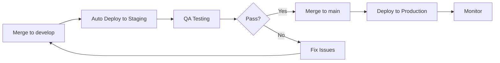
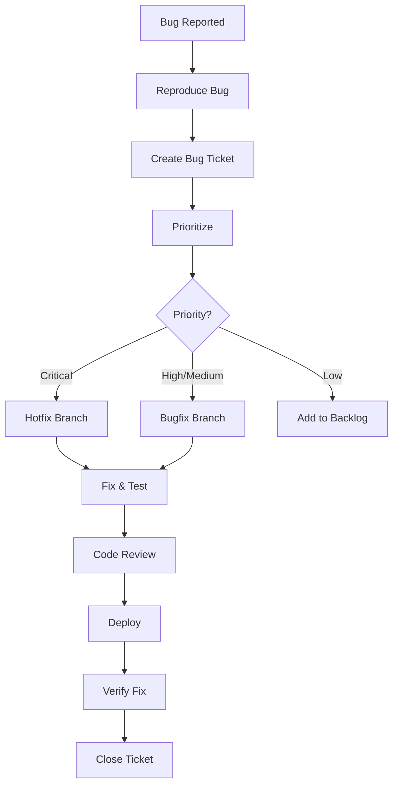

# Development Workflow - Task Management System

**Purpose:** มาตรฐานการทำงานสำหรับทีมพัฒนา

---

## 🔄 Git Workflow

### Branch Strategy

```
main (production)
  ├── develop (staging)
      ├── feature/task-crud
      ├── feature/notification-service
      ├── bugfix/task-update-error
      └── hotfix/security-patch
```

### Branch Naming Convention

| Type | Format | Example |
|------|--------|---------|
| Feature | `feature/description` | `feature/task-notification` |
| Bug Fix | `bugfix/description` | `bugfix/login-error` |
| Hotfix | `hotfix/description` | `hotfix/security-patch` |
| Release | `release/version` | `release/v1.0.0` |

### Commit Message Format

```
<type>(<scope>): <subject>

<body>

<footer>
```

**Types:**
- `feat`: ฟีเจอร์ใหม่
- `fix`: แก้ bug
- `docs`: เอกสาร
- `style`: format code
- `refactor`: ปรับโครงสร้าง
- `test`: เพิ่ม tests
- `chore`: งานทั่วไป

**Examples:**
```bash
feat(task): เพิ่มฟีเจอร์ daily update
fix(notification): แก้ปัญหา due date calculation
docs(api): อัพเดท API documentation
refactor(task-service): ปรับโครงสร้าง task service
```

---

## 🚀 Development Process

### 1. Planning Phase



**Checklist:**
- [ ] อ่าน requirement ให้เข้าใจ
- [ ] ออกแบบ solution
- [ ] สร้าง technical design doc
- [ ] Review กับทีม
- [ ] แบ่ง tasks ย่อย
- [ ] Estimate effort

---

### 2. Development Phase

```bash
# 1. Pull latest code
git checkout develop
git pull origin develop

# 2. Create feature branch
git checkout -b feature/task-notification

# 3. Develop
# - Write code
# - Write tests
# - Update docs

# 4. Commit regularly
git add .
git commit -m "feat(notification): implement due date alert"

# 5. Push to remote
git push origin feature/task-notification

# 6. Create Pull Request
```

**Checklist:**
- [ ] Code ทำงานถูกต้อง
- [ ] Tests ผ่านทั้งหมด
- [ ] Code coverage > 80%
- [ ] ไม่มี console.log
- [ ] ไม่มี sensitive data
- [ ] Update documentation
- [ ] Self code review

---

### 3. Code Review Phase

**Reviewer Checklist:**
- [ ] Code ตรงตาม requirement
- [ ] Code quality ดี (readable, maintainable)
- [ ] Tests ครบถ้วน
- [ ] ไม่มี security issues
- [ ] Performance ดี
- [ ] Documentation ครบ

**Review Comments:**
```markdown
✅ LGTM (Looks Good To Me) - Approve
💬 Comment - ข้อเสนอแนะ
⚠️ Request Changes - ต้องแก้ไข
```

---

### 4. Testing Phase

#### Unit Tests
```bash
# Run all tests
npm test

# Run specific test
npm test -- task.service.test.ts

# Run with coverage
npm test -- --coverage
```

#### Integration Tests
```bash
npm run test:integration
```

#### E2E Tests
```bash
npm run test:e2e
```

---

### 5. Deployment Phase



**Pre-deployment Checklist:**
- [ ] All tests pass
- [ ] Code review approved
- [ ] QA testing pass
- [ ] Database migrations ready
- [ ] Environment variables set
- [ ] Rollback plan ready

---

## 📋 Daily Workflow

### Morning (9:00 - 10:00)
1. ดู notifications และ emails
2. Check task status
3. Update daily plan
4. Stand-up meeting (15 min)

### Working Hours (10:00 - 17:00)
1. Focus on assigned tasks
2. Update task progress (ทุก 2-3 ชั่วโมง)
3. Commit code regularly
4. Ask for help เมื่อติดปัญหา > 30 min

### End of Day (17:00 - 18:00)
1. Update task status
2. Write daily update notes
3. Commit และ push code
4. Review tomorrow's plan

---

## 🧪 Testing Standards

### Unit Test Example
```typescript
describe('TaskService', () => {
  describe('createTask', () => {
    it('should create task successfully', async () => {
      const taskData = {
        title: 'Test Task',
        project_id: 'uuid',
        due_date: '2026-01-30'
      };
      
      const result = await taskService.createTask(taskData);
      
      expect(result.success).toBe(true);
      expect(result.data.title).toBe('Test Task');
    });
    
    it('should throw error if due_date is in the past', async () => {
      const taskData = {
        title: 'Test Task',
        due_date: '2020-01-01'
      };
      
      await expect(taskService.createTask(taskData))
        .rejects.toThrow('Due date must be in the future');
    });
  });
});
```

### Integration Test Example
```typescript
describe('Task API', () => {
  it('POST /tasks should create task', async () => {
    const response = await request(app)
      .post('/api/v1/tasks')
      .set('Authorization', `Bearer ${token}`)
      .send({
        title: 'New Task',
        project_id: projectId,
        due_date: '2026-01-30'
      });
    
    expect(response.status).toBe(201);
    expect(response.body.success).toBe(true);
  });
});
```

---

## 🔒 Security Checklist

### Code Level
- [ ] Input validation ทุก endpoint
- [ ] SQL injection prevention (ใช้ ORM)
- [ ] XSS protection
- [ ] CSRF protection
- [ ] Rate limiting
- [ ] Authentication required
- [ ] Authorization check (RBAC)

### Data Level
- [ ] Encrypt sensitive data
- [ ] Hash passwords (bcrypt)
- [ ] Secure session storage
- [ ] HTTPS only
- [ ] Secure cookies

### Deployment Level
- [ ] Environment variables ไม่ commit
- [ ] API keys ไม่ hardcode
- [ ] Database credentials secure
- [ ] Regular security updates
- [ ] Monitoring และ logging

---

## 📊 Performance Standards

### API Performance
- Response time < 200ms (p95)
- Throughput > 1000 req/s
- Error rate < 1%

### Database
- Query time < 100ms
- Connection pool size: 10-50
- Index ทุก foreign key

### Frontend
- Page load < 2s
- Time to Interactive < 3s
- Lighthouse score > 90

---

## 🐛 Bug Fix Workflow



### Bug Priority

| Priority | Response Time | Fix Time | Example |
|----------|--------------|----------|---------|
| **Critical** | < 1 hour | < 4 hours | System down, data loss |
| **High** | < 4 hours | < 1 day | Major feature broken |
| **Medium** | < 1 day | < 3 days | Minor feature issue |
| **Low** | < 3 days | < 1 week | UI glitch, typo |

---

## 📝 Documentation Standards

### Code Documentation
```typescript
/**
 * สร้าง task ใหม่ในโปรเจค
 * 
 * @param taskData - ข้อมูล task ที่ต้องการสร้าง
 * @returns Promise<Task> - task ที่สร้างเสร็จ
 * @throws ValidationError - ถ้าข้อมูลไม่ถูกต้อง
 * @throws NotFoundError - ถ้าไม่เจอ project
 * 
 * @example
 * ```typescript
 * const task = await createTask({
 *   title: 'New Task',
 *   project_id: 'uuid',
 *   due_date: '2026-01-30'
 * });
 * ```
 */
async function createTask(taskData: CreateTaskDto): Promise<Task> {
  // implementation
}
```

### API Documentation
- ใช้ OpenAPI/Swagger
- ระบุ request/response examples
- ระบุ error codes
- Update ทุกครั้งที่เปลี่ยน API

### README.md
```markdown
# Task Management System

## Quick Start
\`\`\`bash
npm install
npm run dev
\`\`\`

## Environment Variables
- DATABASE_URL
- JWT_SECRET
- REDIS_URL

## Testing
\`\`\`bash
npm test
\`\`\`

## Deployment
See [DEPLOYMENT.md](./DEPLOYMENT.md)
```

---

## 🎯 Definition of Done (DoD)

Task ถือว่าเสร็จเมื่อ:

- [ ] Code complete และทำงานถูกต้อง
- [ ] Unit tests เขียนและผ่าน (coverage > 80%)
- [ ] Integration tests ผ่าน
- [ ] Code review approved
- [ ] Documentation updated
- [ ] No critical bugs
- [ ] Performance meets standards
- [ ] Security checklist passed
- [ ] Deployed to staging
- [ ] QA testing passed
- [ ] Product Owner approved

---

## 🚨 Incident Response

### Severity Levels

| Level | Description | Response Time | Example |
|-------|-------------|---------------|---------|
| **P0** | Critical - System down | Immediate | Database crash |
| **P1** | High - Major feature broken | < 1 hour | Login not working |
| **P2** | Medium - Feature degraded | < 4 hours | Slow performance |
| **P3** | Low - Minor issue | < 1 day | UI glitch |

### Response Process
1. **Detect** - Monitoring alerts
2. **Assess** - Determine severity
3. **Communicate** - Notify stakeholders
4. **Fix** - Deploy hotfix
5. **Verify** - Confirm resolution
6. **Post-mortem** - Document learnings

---

## 📈 Continuous Improvement

### Weekly
- Team retrospective
- Review metrics
- Update documentation

### Monthly
- Performance review
- Security audit
- Dependency updates

### Quarterly
- Architecture review
- Tech debt cleanup
- Training sessions

---

**Last Updated:** 2026-01-22  
**Owner:** Development Team
