# Static PIN Login Implementation Guide

**Created:** 2026-01-22  
**Purpose:** แนะนำวิธีการทำ Static PIN Login (6 หลัก) สำหรับระบบ Task Management

---

## 🎯 Overview

Static PIN Login เป็นวิธี authentication ที่ใช้รหัส PIN 6 หลักที่ **user กำหนดเองและใช้ตลอด** (คล้าย ATM PIN)

### ข้อดี
- ✅ **ง่ายและรวดเร็ว** - ไม่ต้องรอรับ email
- ✅ **จำง่าย** - user กำหนดเอง
- ✅ **Mobile-friendly** - พิมพ์ง่ายบนมือถือ
- ✅ **Offline-capable** - ไม่ต้องพึ่ง email service

### ข้อควรระวัง
- ⚠️ **Security** - ต้องมี rate limiting และ account lockout
- ⚠️ **Brute Force** - ต้องป้องกันการลองหา PIN
- ⚠️ **PIN Reset** - ต้องมีวิธี reset PIN ที่ปลอดภัย

---

## 🔐 Authentication Flow

```mermaid
sequenceDiagram
    participant User
    participant Frontend
    participant Backend
    participant Database

    Note over User,Database: Login Flow
    
    User->>Frontend: กรอก Email + PIN (6 หลัก)
    Frontend->>Backend: POST /auth/login-pin
    Backend->>Database: Query user by email
    Backend->>Backend: Verify PIN (bcrypt compare)
    
    alt PIN ถูกต้อง
        Backend->>Database: Reset failed attempts
        Backend->>Backend: Generate JWT tokens
        Backend->>Frontend: Return tokens + user data
        Frontend->>User: Redirect to Dashboard
    else PIN ผิด
        Backend->>Database: Increment failed attempts
        alt Attempts >= 5
            Backend->>Database: Lock account (15 min)
            Backend->>Frontend: Account locked error
        else Attempts < 5
            Backend->>Frontend: Invalid PIN error
        end
        Frontend->>User: Show error message
    end
```



---

## 💻 Implementation Details

### 1. Database Schema

```sql
-- เพิ่ม columns ใน users table
ALTER TABLE users ADD COLUMN pin_hash VARCHAR(255);
ALTER TABLE users ADD COLUMN pin_set_at TIMESTAMP;
ALTER TABLE users ADD COLUMN failed_pin_attempts INTEGER DEFAULT 0;
ALTER TABLE users ADD COLUMN pin_locked_until TIMESTAMP;

-- หรือสร้าง table แยก
CREATE TABLE user_pins (
  id UUID PRIMARY KEY DEFAULT gen_random_uuid(),
  user_id UUID UNIQUE REFERENCES users(id) ON DELETE CASCADE,
  pin_hash VARCHAR(255) NOT NULL,
  failed_attempts INTEGER DEFAULT 0,
  locked_until TIMESTAMP,
  created_at TIMESTAMP DEFAULT NOW(),
  updated_at TIMESTAMP DEFAULT NOW()
);

-- Index
CREATE INDEX idx_user_pins_user_id ON user_pins(user_id);
```

### 2. Backend API Endpoints

#### A. Setup PIN (First Time / Registration)
```typescript
// POST /api/v1/auth/setup-pin
interface SetupPinDto {
  userId: string;
  pin: string; // 6 digits
  confirmPin: string;
}

interface SetupPinResponse {
  success: boolean;
  message: string;
}

// Validation
const pinSchema = z.object({
  pin: z.string()
    .length(6, 'PIN must be exactly 6 digits')
    .regex(/^\d{6}$/, 'PIN must contain only numbers')
    .refine((pin) => {
      // ห้าม sequential (123456, 654321)
      const isSequential = /^(?:0(?=1)|1(?=2)|2(?=3)|3(?=4)|4(?=5)|5(?=6)|6(?=7)|7(?=8)|8(?=9)){5}\d$/.test(pin);
      const isReverseSequential = /^(?:9(?=8)|8(?=7)|7(?=6)|6(?=5)|5(?=4)|4(?=3)|3(?=2)|2(?=1)|1(?=0)){5}\d$/.test(pin);
      return !isSequential && !isReverseSequential;
    }, 'PIN cannot be sequential')
    .refine((pin) => {
      // ห้าม repeated (111111, 222222)
      return !/^(\d)\1{5}$/.test(pin);
    }, 'PIN cannot be all the same digit'),
  confirmPin: z.string()
}).refine((data) => data.pin === data.confirmPin, {
  message: 'PINs do not match',
  path: ['confirmPin']
});

// Implementation
async function setupPin(userId: string, pin: string, confirmPin: string) {
  // 1. Validate
  const validated = pinSchema.parse({ pin, confirmPin });
  
  // 2. Check if user already has PIN
  const existingPin = await db.userPins.findUnique({
    where: { user_id: userId }
  });
  
  if (existingPin) {
    throw new Error('PIN already set. Use change PIN instead.');
  }
  
  // 3. Hash PIN (bcrypt with high cost factor)
  const pinHash = await bcrypt.hash(pin, 12);
  
  // 4. Save to database
  await db.userPins.create({
    data: {
      user_id: userId,
      pin_hash: pinHash,
      failed_attempts: 0
    }
  });
  
  return {
    success: true,
    message: 'PIN setup successfully'
  };
}
```

#### B. Login with PIN
```typescript
// POST /api/v1/auth/login-pin
interface LoginPinDto {
  email: string;
  pin: string;
}

interface LoginResponse {
  success: boolean;
  data: {
    accessToken: string;
    refreshToken: string;
    user: UserDto;
  };
}

// Implementation
async function loginWithPin(email: string, pin: string) {
  // 1. Find user
  const user = await db.users.findUnique({
    where: { email },
    include: { pin: true }
  });
  
  if (!user || !user.pin) {
    throw new Error('Invalid credentials');
  }
  
  // 2. Check if account is locked
  if (user.pin.locked_until && user.pin.locked_until > new Date()) {
    const remainingMinutes = Math.ceil(
      (user.pin.locked_until.getTime() - Date.now()) / 60000
    );
    throw new Error(
      `Account locked. Try again in ${remainingMinutes} minutes.`
    );
  }
  
  // 3. Verify PIN
  const isValidPin = await bcrypt.compare(pin, user.pin.pin_hash);
  
  if (!isValidPin) {
    // Increment failed attempts
    const newAttempts = user.pin.failed_attempts + 1;
    
    if (newAttempts >= 5) {
      // Lock account for 15 minutes
      await db.userPins.update({
        where: { user_id: user.id },
        data: {
          failed_attempts: newAttempts,
          locked_until: new Date(Date.now() + 15 * 60 * 1000)
        }
      });
      
      throw new Error('Too many failed attempts. Account locked for 15 minutes.');
    }
    
    await db.userPins.update({
      where: { user_id: user.id },
      data: { failed_attempts: newAttempts }
    });
    
    throw new Error(`Invalid PIN. ${5 - newAttempts} attempts remaining.`);
  }
  
  // 4. Reset failed attempts and unlock
  await db.userPins.update({
    where: { user_id: user.id },
    data: {
      failed_attempts: 0,
      locked_until: null
    }
  });
  
  // 5. Generate JWT tokens
  const accessToken = jwt.sign(
    { userId: user.id, email: user.email, role: user.role },
    process.env.JWT_SECRET,
    { expiresIn: '15m' }
  );
  
  const refreshToken = jwt.sign(
    { userId: user.id },
    process.env.JWT_REFRESH_SECRET,
    { expiresIn: '7d' }
  );
  
  // 6. Save refresh token
  await db.refreshTokens.create({
    data: {
      user_id: user.id,
      token: refreshToken,
      expires_at: new Date(Date.now() + 7 * 24 * 60 * 60 * 1000)
    }
  });
  
  return {
    success: true,
    data: {
      accessToken,
      refreshToken,
      user: {
        id: user.id,
        email: user.email,
        name: user.name,
        role: user.role
      }
    }
  };
}
```

#### C. Change PIN
```typescript
// PUT /api/v1/auth/change-pin
interface ChangePinDto {
  currentPin: string;
  newPin: string;
  confirmNewPin: string;
}

async function changePin(userId: string, currentPin: string, newPin: string) {
  // 1. Verify current PIN
  const userPin = await db.userPins.findUnique({
    where: { user_id: userId }
  });
  
  const isValidCurrent = await bcrypt.compare(currentPin, userPin.pin_hash);
  if (!isValidCurrent) {
    throw new Error('Current PIN is incorrect');
  }
  
  // 2. Validate new PIN (same rules as setup)
  pinSchema.parse({ pin: newPin, confirmPin: confirmNewPin });
  
  // 3. Hash and save new PIN
  const newPinHash = await bcrypt.hash(newPin, 12);
  
  await db.userPins.update({
    where: { user_id: userId },
    data: {
      pin_hash: newPinHash,
      failed_attempts: 0,
      locked_until: null,
      updated_at: new Date()
    }
  });
  
  return { success: true, message: 'PIN changed successfully' };
}
```

#### D. Reset PIN (Forgot PIN)
```typescript
// POST /api/v1/auth/reset-pin
interface ResetPinDto {
  email: string;
}

async function requestPinReset(email: string) {
  // 1. Find user
  const user = await db.users.findUnique({ where: { email } });
  if (!user) {
    // Don't reveal if user exists
    return { success: true, message: 'If email exists, reset link sent' };
  }
  
  // 2. Generate reset token (secure random)
  const resetToken = crypto.randomBytes(32).toString('hex');
  const hashedToken = crypto.createHash('sha256').update(resetToken).digest('hex');
  
  // 3. Save token with expiry (1 hour)
  await db.pinResetTokens.create({
    data: {
      user_id: user.id,
      token_hash: hashedToken,
      expires_at: new Date(Date.now() + 60 * 60 * 1000)
    }
  });
  
  // 4. Send email with reset link
  const resetUrl = `${process.env.FRONTEND_URL}/reset-pin?token=${resetToken}`;
  await emailService.sendPinResetEmail({
    to: user.email,
    resetUrl,
    expiresIn: 60
  });
  
  return { success: true, message: 'Reset link sent to your email' };
}

// POST /api/v1/auth/reset-pin/confirm
async function confirmPinReset(token: string, newPin: string) {
  // 1. Hash token and find
  const hashedToken = crypto.createHash('sha256').update(token).digest('hex');
  
  const resetToken = await db.pinResetTokens.findFirst({
    where: {
      token_hash: hashedToken,
      expires_at: { gt: new Date() },
      used_at: null
    }
  });
  
  if (!resetToken) {
    throw new Error('Invalid or expired reset token');
  }
  
  // 2. Validate new PIN
  pinSchema.parse({ pin: newPin, confirmPin: newPin });
  
  // 3. Update PIN
  const newPinHash = await bcrypt.hash(newPin, 12);
  
  await db.userPins.update({
    where: { user_id: resetToken.user_id },
    data: {
      pin_hash: newPinHash,
      failed_attempts: 0,
      locked_until: null
    }
  });
  
  // 4. Mark token as used
  await db.pinResetTokens.update({
    where: { id: resetToken.id },
    data: { used_at: new Date() }
  });
  
  return { success: true, message: 'PIN reset successfully' };
}
```

### 3. Frontend Implementation

#### A. PIN Input Component
```tsx
import React, { useState, useRef } from 'react';
import { Input } from 'antd';

interface PinInputProps {
  length?: number;
  onChange: (pin: string) => void;
  onComplete?: (pin: string) => void;
  masked?: boolean; // แสดงเป็น dots
}

export const PinInput: React.FC<PinInputProps> = ({
  length = 6,
  onChange,
  onComplete,
  masked = true
}) => {
  const [values, setValues] = useState<string[]>(Array(length).fill(''));
  const inputRefs = useRef<(HTMLInputElement | null)[]>([]);

  const handleChange = (index: number, value: string) => {
    if (!/^\d*$/.test(value)) return;

    const newValues = [...values];
    newValues[index] = value.slice(-1);
    setValues(newValues);

    const pin = newValues.join('');
    onChange(pin);

    if (value && index < length - 1) {
      inputRefs.current[index + 1]?.focus();
    }

    if (pin.length === length && onComplete) {
      onComplete(pin);
    }
  };

  const handleKeyDown = (index: number, e: React.KeyboardEvent) => {
    if (e.key === 'Backspace' && !values[index] && index > 0) {
      inputRefs.current[index - 1]?.focus();
    }
  };

  return (
    <div style={{ display: 'flex', gap: '8px' }}>
      {values.map((value, index) => (
        <Input
          key={index}
          ref={(el) => (inputRefs.current[index] = el)}
          value={value}
          onChange={(e) => handleChange(index, e.target.value)}
          onKeyDown={(e) => handleKeyDown(index, e)}
          maxLength={1}
          type={masked ? 'password' : 'text'}
          style={{
            width: '48px',
            height: '56px',
            fontSize: '24px',
            textAlign: 'center',
            fontFamily: 'monospace'
          }}
          inputMode="numeric"
        />
      ))}
    </div>
  );
};
```

#### B. Setup PIN Page
```tsx
import React, { useState } from 'react';
import { Form, Button, message, Typography } from 'antd';
import { LockOutlined, CheckCircleOutlined } from '@ant-design/icons';
import { PinInput } from './PinInput';
import { authApi } from '@/api/auth';

const { Title, Text } = Typography;

export const SetupPinPage: React.FC = () => {
  const [pin, setPin] = useState('');
  const [confirmPin, setConfirmPin] = useState('');
  const [loading, setLoading] = useState(false);

  // PIN validation checks
  const checks = {
    length: pin.length === 6,
    notSequential: !/^(?:0(?=1)|1(?=2)|2(?=3)|3(?=4)|4(?=5)|5(?=6)|6(?=7)|7(?=8)|8(?=9)){5}\d$/.test(pin) &&
                   !/^(?:9(?=8)|8(?=7)|7(?=6)|6(?=5)|5(?=4)|4(?=3)|3(?=2)|2(?=1)|1(?=0)){5}\d$/.test(pin),
    notRepeated: !/^(\d)\1{5}$/.test(pin)
  };

  const handleSubmit = async () => {
    if (pin !== confirmPin) {
      message.error('PINs do not match');
      return;
    }

    if (!Object.values(checks).every(Boolean)) {
      message.error('Please meet all PIN requirements');
      return;
    }

    setLoading(true);
    try {
      await authApi.setupPin(pin, confirmPin);
      message.success('PIN setup successfully!');
      // Redirect to dashboard
      window.location.href = '/dashboard';
    } catch (error) {
      message.error('Failed to setup PIN');
    } finally {
      setLoading(false);
    }
  };

  return (
    <div style={{ maxWidth: 500, margin: '0 auto', padding: '40px 20px' }}>
      <div style={{ textAlign: 'center', marginBottom: 32 }}>
        <LockOutlined style={{ fontSize: 48, color: '#1890ff' }} />
        <Title level={2}>Setup Your PIN</Title>
        <Text type="secondary">Create a 6-digit PIN to secure your account</Text>
      </div>

      <Form layout="vertical">
        <Form.Item label="Create PIN">
          <PinInput onChange={setPin} masked />
          <Text type="secondary" style={{ fontSize: 12 }}>
            Choose a PIN that's easy to remember but hard to guess
          </Text>
        </Form.Item>

        <Form.Item label="Confirm PIN">
          <PinInput onChange={setConfirmPin} masked />
          <Text type="secondary" style={{ fontSize: 12 }}>
            Re-enter your PIN to confirm
          </Text>
        </Form.Item>

        <div style={{ marginTop: 24 }}>
          <Text strong>PIN Requirements:</Text>
          <div style={{ marginTop: 8 }}>
            <div style={{ color: checks.length ? '#52c41a' : '#8c8c8c' }}>
              {checks.length && <CheckCircleOutlined />} Must be 6 digits
            </div>
            <div style={{ color: checks.notSequential ? '#52c41a' : '#8c8c8c' }}>
              {checks.notSequential && <CheckCircleOutlined />} Cannot be sequential (e.g., 123456)
            </div>
            <div style={{ color: checks.notRepeated ? '#52c41a' : '#8c8c8c' }}>
              {checks.notRepeated && <CheckCircleOutlined />} Cannot be repeated (e.g., 111111)
            </div>
          </div>
        </div>

        <div style={{ 
          background: '#e6f7ff', 
          padding: 12, 
          borderRadius: 4, 
          marginTop: 24 
        }}>
          <Text>
            💡 Tip: Use a PIN that's meaningful to you but not obvious to others
          </Text>
        </div>

        <Button
          type="primary"
          onClick={handleSubmit}
          loading={loading}
          disabled={!Object.values(checks).every(Boolean) || pin !== confirmPin}
          block
          style={{ marginTop: 24 }}
        >
          Complete Setup
        </Button>

        <Text type="secondary" style={{ display: 'block', textAlign: 'center', marginTop: 16 }}>
          You can change your PIN anytime in Settings
        </Text>
      </Form>
    </div>
  );
};
```

---

## 🔒 Security Best Practices

### 1. Rate Limiting
```typescript
// Limit login attempts
const pinLoginLimiter = rateLimit({
  windowMs: 15 * 60 * 1000, // 15 minutes
  max: 10, // 10 attempts per window
  message: 'Too many login attempts, please try again later'
});

app.post('/api/v1/auth/login-pin', pinLoginLimiter, loginWithPin);
```

### 2. Account Lockout
- ✅ Lock account after **5 failed attempts**
- ✅ Lock duration: **15 minutes**
- ✅ Reset counter on successful login

### 3. PIN Hashing
- ✅ Use **bcrypt** with cost factor 12
- ✅ Never store plain text PIN
- ✅ Use timing-safe comparison

### 4. PIN Requirements
- ✅ Must be exactly **6 digits**
- ✅ Cannot be sequential (123456, 654321)
- ✅ Cannot be repeated (111111, 222222)
- ✅ Cannot be common PINs (000000, 123123)

### 5. Reset PIN Security
- ✅ Send reset link to email
- ✅ Token expires in **1 hour**
- ✅ One-time use token
- ✅ Secure random token generation

---

## 📊 Comparison: PIN vs Password vs Passcode

| Feature | Static PIN | Password | One-Time Passcode |
|---------|-----------|----------|-------------------|
| **Ease of Use** | ⭐⭐⭐⭐⭐ | ⭐⭐⭐ | ⭐⭐⭐⭐ |
| **Security** | ⭐⭐⭐ | ⭐⭐⭐⭐⭐ | ⭐⭐⭐⭐ |
| **Speed** | ⭐⭐⭐⭐⭐ | ⭐⭐⭐⭐ | ⭐⭐⭐ |
| **Mobile-Friendly** | ⭐⭐⭐⭐⭐ | ⭐⭐⭐ | ⭐⭐⭐⭐ |
| **Offline** | ⭐⭐⭐⭐⭐ | ⭐⭐⭐⭐⭐ | ⭐ |
| **Brute Force Risk** | ⭐⭐ | ⭐⭐⭐⭐ | ⭐⭐⭐⭐⭐ |

---

## 🎯 Recommendations

### ✅ แนะนำให้ใช้ Static PIN เมื่อ:
1. **Internal System** - ระบบภายในองค์กร
2. **Trusted Environment** - สภาพแวดล้อมที่ปลอดภัย
3. **Quick Access** - ต้องการ login เร็ว
4. **Mobile-First** - ใช้งานบนมือถือเป็นหลัก

### ⚠️ ไม่แนะนำให้ใช้ Static PIN เมื่อ:
1. **Public System** - ระบบสาธารณะ
2. **High Security** - ต้องการความปลอดภัยสูง
3. **Financial Data** - มีข้อมูลทางการเงิน
4. **Compliance Required** - ต้องผ่านมาตรฐาน (PCI-DSS, etc.)

### 🔐 Best Practice: Hybrid Approach
```
Primary: Email/Password
Alternative: PIN Login (for convenience)
2FA: Optional (for sensitive actions)
```

---

**Last Updated:** 2026-01-22  
**Author:** Development Team
