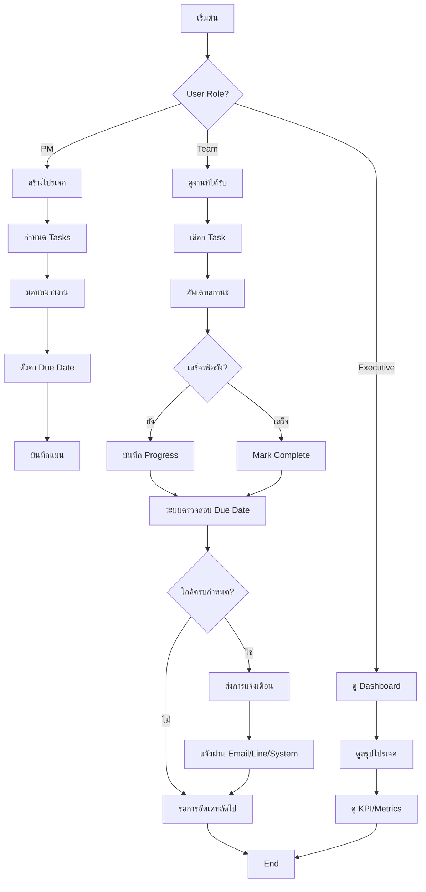
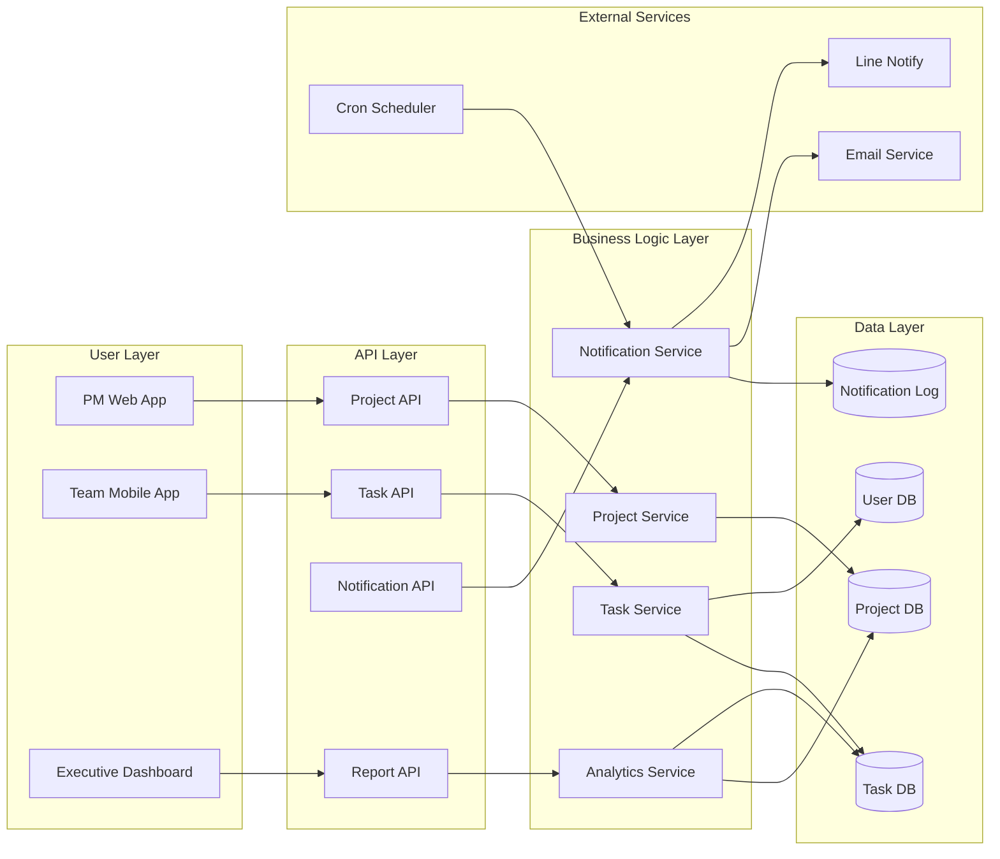

# ระบบกำหนดแผนและติดตามงาน (Task Management System)

**Version:** 1.0  
**Created:** 2026-01-22  
**Purpose:** มาตรฐานการพัฒนาระบบติดตามงานสำหรับองค์กร

---

## 📋 Requirements Overview

### Core Features
1. **กำหนดแผนงาน** - สร้างและจัดการแผนงานโปรเจค
2. **ติดตามงาน** - ติดตามสถานะงานแบบ real-time
3. **แจ้งเตือน Due Date** - แจ้งเตือนอัตโนมัติเมื่อใกล้ครบกำหนด
4. **อัพเดทสถานะรายวัน** - บันทึก progress รายละเอียดทุกวัน

### User Personas
- **Project Manager** - กำหนดแผน, มอบหมายงาน, ติดตามความคืบหน้า
- **Team Member** - รับงาน, อัพเดทสถานะ, รายงานปัญหา
- **Executive** - ดู Dashboard, รับรายงานสรุป

---

## 🔄 System Flow



### Flow Explanation

#### 1. Project Creation Flow (PM)
```
PM Login → Create Project → Define Tasks → Assign Members → Set Timeline → Save
```

#### 2. Task Update Flow (Team Member)
```
Login → View My Tasks → Select Task → Update Status → Add Notes → Save → Trigger Notification Check
```

#### 3. Notification Flow (System)
```
Cron Job (Daily) → Check All Tasks → Filter (Due in 1-3 days) → Send Notifications → Log
```

#### 4. Dashboard Flow (Executive)
```
Login → View Dashboard → Select Project/Team → View Metrics → Export Report
```

---

## 📊 Data Flow Diagram



### Data Flow Details

#### 1. Create Task Flow
```
PM Input → Validate → Save to Task DB → Link to Project → Assign User → Create Notification Schedule
```

#### 2. Update Status Flow
```
Team Input → Validate → Update Task DB → Log History → Check Due Date → Trigger Notification (if needed)
```

#### 3. Notification Flow
```
Scheduler → Query Tasks (Due Soon) → Format Message → Send via Channel → Log Result
```

#### 4. Report Generation Flow
```
Request → Query Multiple DBs → Aggregate Data → Calculate Metrics → Format Response → Cache
```

---

## 🏗️ System Layer Architecture

### Layer 1: Presentation Layer (Frontend)

```
┌─────────────────────────────────────────┐
│         Presentation Layer              │
├─────────────────────────────────────────┤
│  Web App (React/Next.js)                │
│  - PM Dashboard                         │
│  - Project Management UI                │
│  - Task Board (Kanban)                  │
│                                         │
│  Mobile App (React Native)              │
│  - Task List View                       │
│  - Quick Status Update                  │
│  - Notification Center                  │
│                                         │
│  Executive Dashboard (React)            │
│  - Analytics & Reports                  │
│  - KPI Visualization                    │
└─────────────────────────────────────────┘
```

**Technologies:**
- **Web:** Next.js 14, TypeScript, TailwindCSS
- **Mobile:** React Native, Expo
- **State Management:** Zustand / React Query
- **Charts:** Recharts / Chart.js

---

### Layer 2: API Gateway Layer

```
┌─────────────────────────────────────────┐
│           API Gateway                   │
├─────────────────────────────────────────┤
│  - Authentication (JWT)                 │
│  - Rate Limiting                        │
│  - Request Validation                   │
│  - API Routing                          │
│  - CORS Handling                        │
└─────────────────────────────────────────┘
```

**Technologies:**
- **Framework:** Express.js / Fastify
- **Auth:** JWT + Refresh Token
- **Validation:** Zod / Joi
- **Documentation:** Swagger/OpenAPI

---

### Layer 3: Business Logic Layer (Backend Services)

```
┌─────────────────────────────────────────┐
│        Business Logic Layer             │
├─────────────────────────────────────────┤
│                                         │
│  📁 Project Service                     │
│    - Create/Update/Delete Project       │
│    - Project Timeline Management        │
│    - Member Assignment                  │
│                                         │
│  📋 Task Service                        │
│    - CRUD Operations                    │
│    - Status Management                  │
│    - Progress Tracking                  │
│    - History Logging                    │
│                                         │
│  🔔 Notification Service                │
│    - Due Date Monitoring                │
│    - Alert Generation                   │
│    - Multi-channel Delivery             │
│    - Notification Preferences           │
│                                         │
│  👥 User Service                        │
│    - Authentication                     │
│    - Authorization (RBAC)               │
│    - User Profile Management            │
│                                         │
│  📊 Analytics Service                   │
│    - Report Generation                  │
│    - KPI Calculation                    │
│    - Data Aggregation                   │
│                                         │
│  ⏰ Scheduler Service                   │
│    - Cron Jobs                          │
│    - Background Tasks                   │
│    - Queue Management                   │
└─────────────────────────────────────────┘
```

**Technologies:**
- **Runtime:** Node.js / Bun
- **Framework:** NestJS / Express
- **Language:** TypeScript
- **Queue:** Bull / BullMQ (Redis)
- **Scheduler:** node-cron / Agenda

---

### Layer 4: Data Access Layer

```
┌─────────────────────────────────────────┐
│        Data Access Layer (DAL)          │
├─────────────────────────────────────────┤
│  - Repository Pattern                   │
│  - Query Builders                       │
│  - Transaction Management               │
│  - Connection Pooling                   │
│  - Cache Management                     │
└─────────────────────────────────────────┘
```

**Technologies:**
- **ORM:** Prisma / TypeORM
- **Query Builder:** Kysely (optional)
- **Migration:** Prisma Migrate

---

### Layer 5: Data Storage Layer

```
┌─────────────────────────────────────────┐
│         Data Storage Layer              │
├─────────────────────────────────────────┤
│                                         │
│  🗄️ Primary Database (PostgreSQL)      │
│    - Projects                           │
│    - Tasks                              │
│    - Users                              │
│    - Task History                       │
│    - Assignments                        │
│                                         │
│  ⚡ Cache (Redis)                       │
│    - Session Storage                    │
│    - API Response Cache                 │
│    - Queue Management                   │
│                                         │
│  📁 File Storage (S3/MinIO)             │
│    - Attachments                        │
│    - Documents                          │
│    - Export Files                       │
│                                         │
│  📝 Logs (MongoDB/ELK)                  │
│    - Application Logs                   │
│    - Audit Trails                       │
│    - Notification Logs                  │
└─────────────────────────────────────────┘
```

---

### Layer 6: External Integration Layer

```
┌─────────────────────────────────────────┐
│      External Integration Layer         │
├─────────────────────────────────────────┤
│  📧 Email Service (SendGrid/SES)        │
│  💬 Line Notify API                     │
│  📱 Push Notification (FCM)             │
│  📊 Analytics (Google Analytics)        │
│  🔐 SSO Integration (Optional)          │
└─────────────────────────────────────────┘
```

---

## 🗂️ Database Schema Design

### Core Tables

#### 1. Projects
```sql
CREATE TABLE projects (
  id UUID PRIMARY KEY DEFAULT gen_random_uuid(),
  name VARCHAR(255) NOT NULL,
  description TEXT,
  start_date DATE NOT NULL,
  end_date DATE NOT NULL,
  status VARCHAR(50) DEFAULT 'active', -- active, completed, on_hold, cancelled
  owner_id UUID REFERENCES users(id),
  created_at TIMESTAMP DEFAULT NOW(),
  updated_at TIMESTAMP DEFAULT NOW()
);
```

#### 2. Tasks
```sql
CREATE TABLE tasks (
  id UUID PRIMARY KEY DEFAULT gen_random_uuid(),
  project_id UUID REFERENCES projects(id) ON DELETE CASCADE,
  parent_task_id UUID REFERENCES tasks(id), -- for sub-tasks
  title VARCHAR(255) NOT NULL,
  description TEXT,
  status VARCHAR(50) DEFAULT 'todo', -- todo, in_progress, review, done, blocked
  priority VARCHAR(20) DEFAULT 'medium', -- low, medium, high, urgent
  assigned_to UUID REFERENCES users(id),
  created_by UUID REFERENCES users(id),
  start_date DATE,
  due_date DATE NOT NULL,
  completed_date DATE,
  progress INTEGER DEFAULT 0, -- 0-100
  estimated_hours DECIMAL(5,2),
  actual_hours DECIMAL(5,2),
  created_at TIMESTAMP DEFAULT NOW(),
  updated_at TIMESTAMP DEFAULT NOW()
);
```

#### 3. Task Updates (Daily Progress)
```sql
CREATE TABLE task_updates (
  id UUID PRIMARY KEY DEFAULT gen_random_uuid(),
  task_id UUID REFERENCES tasks(id) ON DELETE CASCADE,
  user_id UUID REFERENCES users(id),
  status VARCHAR(50) NOT NULL,
  progress INTEGER NOT NULL,
  notes TEXT,
  hours_spent DECIMAL(5,2),
  blockers TEXT,
  update_date DATE DEFAULT CURRENT_DATE,
  created_at TIMESTAMP DEFAULT NOW()
);
```

#### 4. Notifications
```sql
CREATE TABLE notifications (
  id UUID PRIMARY KEY DEFAULT gen_random_uuid(),
  task_id UUID REFERENCES tasks(id) ON DELETE CASCADE,
  user_id UUID REFERENCES users(id),
  type VARCHAR(50) NOT NULL, -- due_soon, overdue, status_change, assignment
  title VARCHAR(255) NOT NULL,
  message TEXT,
  channels JSONB, -- ["email", "line", "push"]
  sent_at TIMESTAMP,
  read_at TIMESTAMP,
  created_at TIMESTAMP DEFAULT NOW()
);
```

#### 5. Users
```sql
CREATE TABLE users (
  id UUID PRIMARY KEY DEFAULT gen_random_uuid(),
  email VARCHAR(255) UNIQUE NOT NULL,
  name VARCHAR(255) NOT NULL,
  role VARCHAR(50) DEFAULT 'member', -- admin, pm, member, executive
  line_user_id VARCHAR(255),
  notification_preferences JSONB,
  created_at TIMESTAMP DEFAULT NOW(),
  updated_at TIMESTAMP DEFAULT NOW()
);
```

---

## 🔔 Notification Strategy

### Notification Types

| Type | Trigger | Timing | Channels |
|------|---------|--------|----------|
| **Due Soon** | Task due in 3 days | Daily 9:00 AM | Email, Line |
| **Due Tomorrow** | Task due in 1 day | Daily 9:00 AM | Email, Line, Push |
| **Overdue** | Task past due date | Daily 9:00 AM | Email, Line, Push |
| **Status Change** | Task status updated | Real-time | Push, Line |
| **Assignment** | New task assigned | Real-time | Email, Push |
| **Completion** | Task marked done | Real-time | Email (PM only) |

### Notification Rules

```typescript
// Pseudo-code for notification logic
const notificationRules = {
  dueSoon: {
    condition: (task) => {
      const daysUntilDue = daysBetween(today, task.due_date);
      return daysUntilDue <= 3 && daysUntilDue > 0 && task.status !== 'done';
    },
    channels: ['email', 'line'],
    schedule: 'daily_9am'
  },
  
  overdue: {
    condition: (task) => {
      return task.due_date < today && task.status !== 'done';
    },
    channels: ['email', 'line', 'push'],
    schedule: 'daily_9am',
    escalate: true // notify PM after 2 days
  },
  
  statusChange: {
    condition: (task, oldStatus, newStatus) => {
      return oldStatus !== newStatus;
    },
    channels: ['push'],
    recipients: ['assigned_user', 'project_owner']
  }
};
```

---

## 📈 Key Performance Indicators (KPIs)

### Project Level
- **On-Time Completion Rate** = (Tasks completed on time / Total tasks) × 100
- **Average Task Duration** = Sum of actual hours / Number of tasks
- **Overdue Task Count** = Count of tasks past due date
- **Project Progress** = (Completed tasks / Total tasks) × 100

### Team Level
- **Task Completion Rate** = Tasks completed / Tasks assigned
- **Average Response Time** = Time from assignment to first update
- **Daily Update Compliance** = (Days with updates / Total working days) × 100

### Individual Level
- **Tasks Completed** = Count of completed tasks
- **Average Task Quality** = Based on review feedback
- **Update Frequency** = Number of status updates per task

---

## 🚀 Development Roadmap

### Phase 1: MVP (4-6 weeks)
- [ ] User Authentication & Authorization
- [ ] Project CRUD
- [ ] Task CRUD with basic status
- [ ] Simple notification (Email only)
- [ ] Basic dashboard

### Phase 2: Core Features (6-8 weeks)
- [ ] Task hierarchy (Parent-Child)
- [ ] Daily progress updates
- [ ] Multi-channel notifications (Email + Line)
- [ ] Advanced dashboard with charts
- [ ] Mobile app (basic)

### Phase 3: Advanced Features (8-10 weeks)
- [ ] Analytics & Reporting
- [ ] Task dependencies
- [ ] Time tracking
- [ ] File attachments
- [ ] API for integrations

### Phase 4: Optimization (4-6 weeks)
- [ ] Performance optimization
- [ ] Advanced caching
- [ ] Real-time updates (WebSocket)
- [ ] Mobile app (full features)
- [ ] Export/Import functionality

---

## 🛠️ Technology Stack Summary

| Layer | Technology |
|-------|-----------|
| **Frontend Web** | Next.js 14, TypeScript, TailwindCSS, Zustand |
| **Frontend Mobile** | React Native, Expo |
| **Backend** | Node.js, NestJS, TypeScript |
| **Database** | PostgreSQL 15+ |
| **Cache** | Redis 7+ |
| **Queue** | BullMQ (Redis-based) |
| **File Storage** | AWS S3 / MinIO |
| **Email** | SendGrid / AWS SES |
| **Notifications** | Line Notify API, FCM |
| **Deployment** | Docker, Kubernetes / AWS ECS |
| **CI/CD** | GitHub Actions |
| **Monitoring** | Sentry, DataDog |

---

## 📝 Development Standards

### Code Standards
- ใช้ TypeScript strict mode
- ESLint + Prettier
- Conventional Commits
- Code review required
- Test coverage > 80%

### API Standards
- RESTful design
- Versioning (v1, v2)
- Consistent error handling
- OpenAPI documentation
- Rate limiting

### Security Standards
- JWT authentication
- RBAC authorization
- Input validation (Zod)
- SQL injection prevention (ORM)
- XSS protection
- HTTPS only

### Testing Standards
- Unit tests (Jest)
- Integration tests (Supertest)
- E2E tests (Playwright)
- Load testing (k6)

---

## 🎯 Success Criteria

1. **Performance**
   - API response time < 200ms (p95)
   - Page load time < 2s
   - 99.9% uptime

2. **User Adoption**
   - 80% daily active users
   - 90% notification open rate
   - < 5% task overdue rate

3. **Quality**
   - Zero critical bugs in production
   - < 1% error rate
   - Test coverage > 80%

---

## 📚 Next Steps

1. Review และ approve design นี้
2. Setup development environment
3. Create detailed API specifications
4. Design UI/UX mockups
5. Start Phase 1 development

---

**Document Owner:** Development Team  
**Last Updated:** 2026-01-22  
**Status:** Draft - Pending Review
