# Passcode Login Implementation Guide

**Created:** 2026-01-22  
**Purpose:** แนะนำวิธีการทำ Passcode Login (6 หลัก) สำหรับระบบ Task Management

---

## 🎯 Overview

Passcode Login เป็นวิธี authentication ที่ใช้รหัส 6 หลัก แทนการใช้ password ทำให้:
- ✅ **ง่ายต่อการใช้งาน** - จำง่าย พิมพ์เร็ว
- ✅ **ปลอดภัย** - Passcode มี expiration time
- ✅ **Mobile-friendly** - เหมาะกับการใช้งานบนมือถือ
- ✅ **2FA Ready** - สามารถใช้เป็น 2-Factor Authentication ได้

---

## 🔐 Authentication Flow

### Option 1: Passcode as Primary Login (แนะนำ)

```mermaid
sequenceDiagram
    participant User
    participant Frontend
    participant Backend
    participant Email Service
    participant Database

    User->>Frontend: กรอก Email
    Frontend->>Backend: POST /auth/request-passcode
    Backend->>Database: Check if user exists
    Backend->>Backend: Generate 6-digit passcode
    Backend->>Database: Save passcode + expiry (5 min)
    Backend->>Email Service: Send passcode to email
    Email Service->>User: Email with passcode
    Backend->>Frontend: Success (passcode sent)
    
    User->>Frontend: กรอก Passcode (6 หลัก)
    Frontend->>Backend: POST /auth/login-passcode
    Backend->>Database: Verify passcode + check expiry
    Backend->>Backend: Generate JWT tokens
    Backend->>Frontend: Return access + refresh tokens
    Frontend->>Frontend: Store tokens
    Frontend->>User: Redirect to Dashboard
```



### Option 2: Passcode as 2FA (Two-Factor Authentication)

```mermaid
sequenceDiagram
    participant User
    participant Frontend
    participant Backend
    participant Email Service

    User->>Frontend: Login with Email/Password
    Frontend->>Backend: POST /auth/login
    Backend->>Backend: Verify credentials
    Backend->>Backend: Generate 6-digit passcode
    Backend->>Email Service: Send passcode
    Backend->>Frontend: Return temp token (require 2FA)
    
    User->>Frontend: กรอก Passcode
    Frontend->>Backend: POST /auth/verify-2fa
    Backend->>Backend: Verify passcode
    Backend->>Frontend: Return full access tokens
    Frontend->>User: Redirect to Dashboard
```



---

## 💻 Implementation Details

### 1. Database Schema

```sql
-- เพิ่ม table สำหรับเก็บ passcodes
CREATE TABLE passcodes (
  id UUID PRIMARY KEY DEFAULT gen_random_uuid(),
  user_id UUID REFERENCES users(id) ON DELETE CASCADE,
  passcode VARCHAR(6) NOT NULL,
  type VARCHAR(20) DEFAULT 'login', -- login, 2fa, reset_password
  expires_at TIMESTAMP NOT NULL,
  used_at TIMESTAMP,
  ip_address VARCHAR(45),
  created_at TIMESTAMP DEFAULT NOW()
);

-- Index สำหรับ performance
CREATE INDEX idx_passcodes_user_id ON passcodes(user_id);
CREATE INDEX idx_passcodes_expires_at ON passcodes(expires_at);
```

### 2. Backend API Endpoints

#### A. Request Passcode
```typescript
// POST /api/v1/auth/request-passcode
interface RequestPasscodeDto {
  email: string;
}

interface RequestPasscodeResponse {
  success: boolean;
  message: string;
  expiresIn: number; // seconds
}

// Implementation
async function requestPasscode(email: string) {
  // 1. ตรวจสอบว่า user มีอยู่จริง
  const user = await db.users.findUnique({ where: { email } });
  if (!user) {
    throw new Error('User not found');
  }
  
  // 2. สร้าง 6-digit passcode (random)
  const passcode = Math.floor(100000 + Math.random() * 900000).toString();
  
  // 3. Hash passcode ก่อน save (security)
  const hashedPasscode = await bcrypt.hash(passcode, 10);
  
  // 4. บันทึกลง database พร้อม expiry (5 นาที)
  await db.passcodes.create({
    data: {
      user_id: user.id,
      passcode: hashedPasscode,
      type: 'login',
      expires_at: new Date(Date.now() + 5 * 60 * 1000), // 5 minutes
      ip_address: req.ip
    }
  });
  
  // 5. ส่ง email
  await emailService.sendPasscode({
    to: user.email,
    passcode: passcode, // ส่ง plain text ใน email
    expiresIn: 5
  });
  
  return {
    success: true,
    message: 'Passcode sent to your email',
    expiresIn: 300
  };
}
```

#### B. Login with Passcode
```typescript
// POST /api/v1/auth/login-passcode
interface LoginPasscodeDto {
  email: string;
  passcode: string;
}

interface LoginResponse {
  success: boolean;
  data: {
    accessToken: string;
    refreshToken: string;
    user: UserDto;
  };
}

// Implementation
async function loginWithPasscode(email: string, passcode: string) {
  // 1. หา user
  const user = await db.users.findUnique({ where: { email } });
  if (!user) {
    throw new Error('Invalid credentials');
  }
  
  // 2. หา passcode ที่ยังไม่ expire และยังไม่ถูกใช้
  const validPasscode = await db.passcodes.findFirst({
    where: {
      user_id: user.id,
      type: 'login',
      expires_at: { gt: new Date() },
      used_at: null
    },
    orderBy: { created_at: 'desc' }
  });
  
  if (!validPasscode) {
    throw new Error('Passcode expired or invalid');
  }
  
  // 3. Verify passcode
  const isValid = await bcrypt.compare(passcode, validPasscode.passcode);
  if (!isValid) {
    throw new Error('Invalid passcode');
  }
  
  // 4. Mark passcode as used
  await db.passcodes.update({
    where: { id: validPasscode.id },
    data: { used_at: new Date() }
  });
  
  // 5. Generate JWT tokens
  const accessToken = jwt.sign(
    { userId: user.id, email: user.email, role: user.role },
    process.env.JWT_SECRET,
    { expiresIn: '15m' }
  );
  
  const refreshToken = jwt.sign(
    { userId: user.id },
    process.env.JWT_REFRESH_SECRET,
    { expiresIn: '7d' }
  );
  
  // 6. Save refresh token
  await db.refreshTokens.create({
    data: {
      user_id: user.id,
      token: refreshToken,
      expires_at: new Date(Date.now() + 7 * 24 * 60 * 60 * 1000)
    }
  });
  
  return {
    success: true,
    data: {
      accessToken,
      refreshToken,
      user: {
        id: user.id,
        email: user.email,
        name: user.name,
        role: user.role
      }
    }
  };
}
```

### 3. Frontend Implementation

#### A. Passcode Input Component (React + TypeScript)
```tsx
import React, { useState, useRef, useEffect } from 'react';
import { Input } from 'antd';

interface PasscodeInputProps {
  length?: number;
  onChange: (passcode: string) => void;
  onComplete?: (passcode: string) => void;
}

export const PasscodeInput: React.FC<PasscodeInputProps> = ({
  length = 6,
  onChange,
  onComplete
}) => {
  const [values, setValues] = useState<string[]>(Array(length).fill(''));
  const inputRefs = useRef<(HTMLInputElement | null)[]>([]);

  const handleChange = (index: number, value: string) => {
    // อนุญาตเฉพาะตัวเลข
    if (!/^\d*$/.test(value)) return;

    const newValues = [...values];
    newValues[index] = value.slice(-1); // เอาแค่ตัวสุดท้าย
    setValues(newValues);

    const passcode = newValues.join('');
    onChange(passcode);

    // Auto-focus ช่องถัดไป
    if (value && index < length - 1) {
      inputRefs.current[index + 1]?.focus();
    }

    // เมื่อกรอกครบ
    if (passcode.length === length && onComplete) {
      onComplete(passcode);
    }
  };

  const handleKeyDown = (index: number, e: React.KeyboardEvent) => {
    // Backspace: ลบและย้อนกลับ
    if (e.key === 'Backspace' && !values[index] && index > 0) {
      inputRefs.current[index - 1]?.focus();
    }
  };

  const handlePaste = (e: React.ClipboardEvent) => {
    e.preventDefault();
    const pastedData = e.clipboardData.getData('text').slice(0, length);
    
    if (!/^\d+$/.test(pastedData)) return;

    const newValues = pastedData.split('');
    setValues([...newValues, ...Array(length - newValues.length).fill('')]);
    
    const passcode = pastedData;
    onChange(passcode);
    
    if (passcode.length === length && onComplete) {
      onComplete(passcode);
    }
  };

  return (
    <div className="passcode-input" style={{ display: 'flex', gap: '8px' }}>
      {values.map((value, index) => (
        <Input
          key={index}
          ref={(el) => (inputRefs.current[index] = el)}
          value={value}
          onChange={(e) => handleChange(index, e.target.value)}
          onKeyDown={(e) => handleKeyDown(index, e)}
          onPaste={handlePaste}
          maxLength={1}
          style={{
            width: '48px',
            height: '56px',
            fontSize: '24px',
            textAlign: 'center',
            fontFamily: 'monospace'
          }}
          type="text"
          inputMode="numeric"
        />
      ))}
    </div>
  );
};
```

#### B. Login Page Component
```tsx
import React, { useState } from 'react';
import { Form, Input, Button, Tabs, message } from 'antd';
import { PasscodeInput } from './PasscodeInput';
import { authApi } from '@/api/auth';

export const LoginPage: React.FC = () => {
  const [activeTab, setActiveTab] = useState<'email' | 'passcode'>('passcode');
  const [email, setEmail] = useState('');
  const [passcode, setPasscode] = useState('');
  const [passcodeSent, setPasscodeSent] = useState(false);
  const [loading, setLoading] = useState(false);

  const handleRequestPasscode = async () => {
    if (!email) {
      message.error('Please enter your email');
      return;
    }

    setLoading(true);
    try {
      await authApi.requestPasscode(email);
      setPasscodeSent(true);
      message.success('Passcode sent to your email');
    } catch (error) {
      message.error('Failed to send passcode');
    } finally {
      setLoading(false);
    }
  };

  const handlePasscodeComplete = async (code: string) => {
    setLoading(true);
    try {
      const response = await authApi.loginWithPasscode(email, code);
      
      // Save tokens
      localStorage.setItem('accessToken', response.data.accessToken);
      localStorage.setItem('refreshToken', response.data.refreshToken);
      
      // Redirect to dashboard
      window.location.href = '/dashboard';
    } catch (error) {
      message.error('Invalid passcode');
      setPasscode('');
    } finally {
      setLoading(false);
    }
  };

  return (
    <div className="login-page">
      <Tabs activeKey={activeTab} onChange={(key) => setActiveTab(key as any)}>
        <Tabs.TabPane tab="Email Login" key="email">
          {/* Email/Password form */}
        </Tabs.TabPane>
        
        <Tabs.TabPane tab="Passcode Login" key="passcode">
          <Form layout="vertical">
            <Form.Item label="Email">
              <Input
                type="email"
                value={email}
                onChange={(e) => setEmail(e.target.value)}
                placeholder="Enter your email address"
                disabled={passcodeSent}
              />
            </Form.Item>

            {!passcodeSent ? (
              <Button
                type="primary"
                onClick={handleRequestPasscode}
                loading={loading}
                block
              >
                Send Passcode
              </Button>
            ) : (
              <>
                <Form.Item label="Passcode">
                  <PasscodeInput
                    onChange={setPasscode}
                    onComplete={handlePasscodeComplete}
                  />
                  <p style={{ marginTop: '8px', fontSize: '12px', color: '#8c8c8c' }}>
                    Passcode is 6 digits sent to your email
                  </p>
                </Form.Item>

                <Button
                  type="link"
                  onClick={handleRequestPasscode}
                  loading={loading}
                >
                  Resend Passcode
                </Button>

                <Button
                  type="primary"
                  onClick={() => handlePasscodeComplete(passcode)}
                  loading={loading}
                  disabled={passcode.length !== 6}
                  block
                >
                  Sign In
                </Button>
              </>
            )}
          </Form>
        </Tabs.TabPane>
      </Tabs>
    </div>
  );
};
```

---

## 📧 Email Template

```html
<!DOCTYPE html>
<html>
<head>
  <style>
    body { font-family: Arial, sans-serif; }
    .container { max-width: 600px; margin: 0 auto; padding: 20px; }
    .passcode { 
      font-size: 32px; 
      font-weight: bold; 
      letter-spacing: 8px;
      color: #1890ff;
      text-align: center;
      padding: 20px;
      background: #f0f0f0;
      border-radius: 8px;
      margin: 20px 0;
    }
  </style>
</head>
<body>
  <div class="container">
    <h2>Your TaskFlow Login Passcode</h2>
    <p>Hello,</p>
    <p>Use this passcode to sign in to your account:</p>
    
    <div class="passcode">{{PASSCODE}}</div>
    
    <p><strong>This passcode will expire in 5 minutes.</strong></p>
    
    <p>If you didn't request this passcode, please ignore this email.</p>
    
    <hr>
    <p style="font-size: 12px; color: #8c8c8c;">
      TaskFlow - Task Management System
    </p>
  </div>
</body>
</html>
```

---

## 🔒 Security Best Practices

### 1. Rate Limiting
```typescript
// จำกัดจำนวนครั้งในการขอ passcode
const rateLimiter = rateLimit({
  windowMs: 15 * 60 * 1000, // 15 minutes
  max: 5, // 5 requests per window
  message: 'Too many passcode requests, please try again later'
});

app.post('/api/v1/auth/request-passcode', rateLimiter, requestPasscode);
```

### 2. Passcode Expiration
- ✅ Passcode หมดอายุใน **5 นาที**
- ✅ ใช้ได้เพียง **1 ครั้ง** (one-time use)
- ✅ Passcode เก่าจะถูก invalidate เมื่อขอใหม่

### 3. Brute Force Protection
```typescript
// จำกัดจำนวนครั้งในการลอง login
const loginLimiter = rateLimit({
  windowMs: 15 * 60 * 1000,
  max: 10,
  skipSuccessfulRequests: true
});

app.post('/api/v1/auth/login-passcode', loginLimiter, loginWithPasscode);
```

### 4. Hash Passcode
- ✅ Hash passcode ก่อน save ลง database (bcrypt)
- ✅ ไม่เก็บ plain text passcode

---

## 📊 Advantages & Disadvantages

### ✅ Advantages
1. **User-Friendly** - ง่ายกว่า password
2. **Mobile-Optimized** - พิมพ์ง่ายบนมือถือ
3. **No Password Reset** - ไม่ต้องจำ password
4. **Time-Limited** - ปลอดภัยกว่า static password
5. **2FA Ready** - ใช้เป็น 2FA ได้

### ⚠️ Disadvantages
1. **Email Dependency** - ต้องมี email access
2. **Delay** - รอรับ email (1-30 วินาที)
3. **Spam Filter** - อาจติด spam folder
4. **Network Required** - ต้องมี internet

---

## 🎯 Recommendations

### สำหรับระบบนี้ แนะนำให้ใช้:

**Option: Hybrid Approach (แนะนำที่สุด)**
- ✅ **Default:** Email/Password login
- ✅ **Alternative:** Passcode login (สำหรับ convenience)
- ✅ **2FA:** Optional passcode 2FA สำหรับ sensitive actions

### Implementation Priority
1. **Phase 1:** Email/Password login (MVP)
2. **Phase 2:** เพิ่ม Passcode login option
3. **Phase 3:** เพิ่ม 2FA (optional)

---

**Last Updated:** 2026-01-22  
**Author:** Development Team
